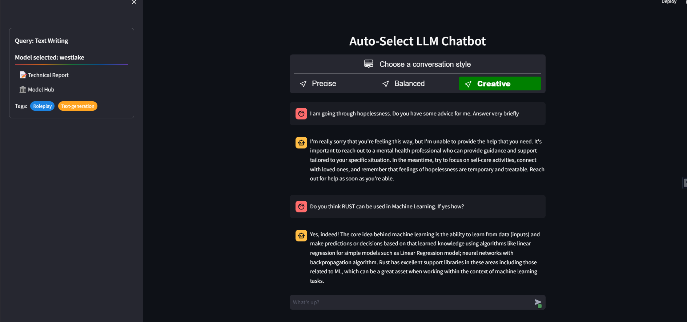

# Auto-Select LLM chat using ollama
* Automatically selects the appropriate/best open-source LLM (quantized) based on user query.
* Allows the user to see his query's category and the relevant model along with its details.
* Setting for adjusting creativity parameter of the responses.
* In another version, "user_select_chat.py", user can select his category of conversation and also use some tips to compose his message.

## Note
* Other model parameters, including system prompts and chat templates can also be modified follwing ollama python's [API](https://github.com/ollama/ollama/blob/main/docs/api.md)

