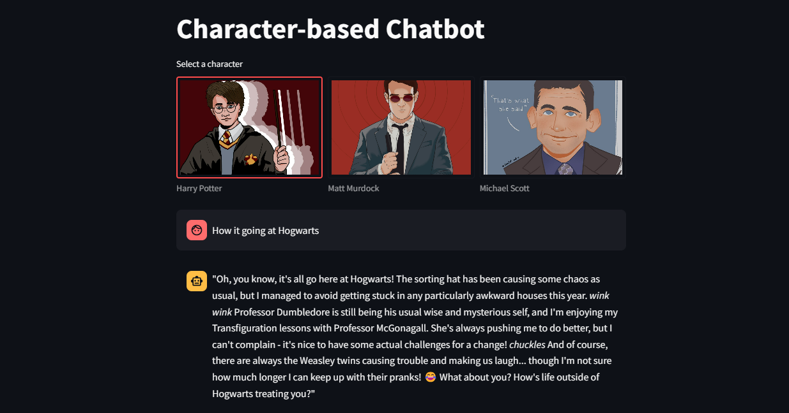

# Character based chat using ollama
* Uses ollama python package and streamlit to select a fictional character to chat with.
* Each character's modelfile dictates it behaviour and is created from an existing open-source LLM using [ollama](https://github.com/ollama/ollama/blob/main/docs/modelfile.md).
* Separate chat history maintained for each character. 

