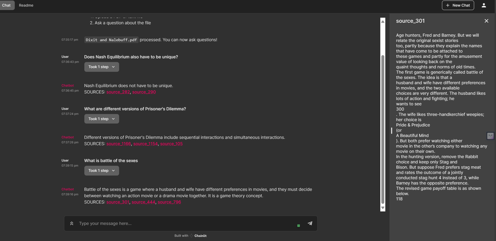

# RAG-based QnA App with textbook
* Allows user to upload PDF/txt file of upto 20 MB size.
* Responses to the user query from the textbook, citing relevant sources.
* Uses openai ada-2 embeddings to encode context documents and query and Chat-GPT to provide responses.

